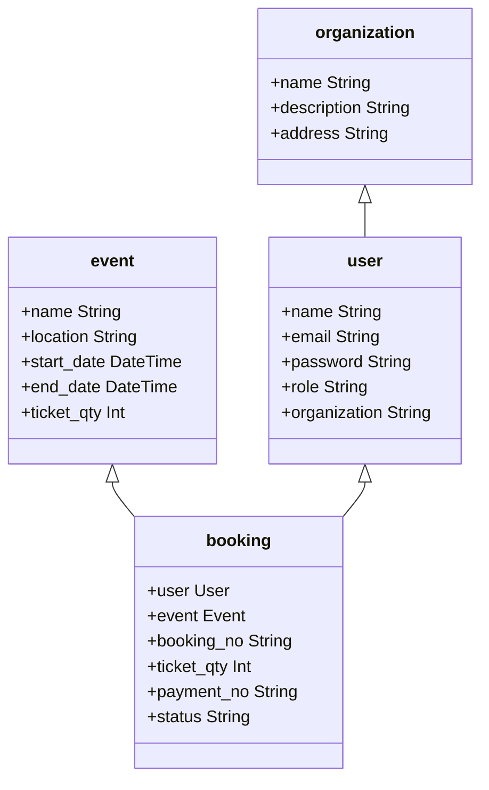

## Description
Ticketing System using NEST JS. 
- Class Diagram



## Installation

```bash
$ npm install
```

## Running the app

```bash
# development
$ npm run start
```
## Build the app
```bash
$ npm install
$ npm run build # both ReactJS and NestJS
$ npm run build:backend # only NestJS backend
$ npm run build:frontend # only ReactJS frontend
```
## Test

```bash
$ npm run test # run project tests under `cypress/integration`
```

